# How It Was Built

!!! info "🤖 AI-Generated with Human Oversight"
    Every line of Rust, Python, and configuration in httpxr was written by an AI coding agent powered by **Claude Opus 4.6**. The iterative process of getting all 1300+ tests to pass involved human oversight — reviewing agent output, steering direction, and deciding next steps. This was a human-in-the-loop collaboration, not a fully autonomous push-button workflow — but it demonstrates the potential of AI agents given a clear, measurable goal, and hints at a near future where this kind of work runs fully autonomously.

## Why This Exists

Great Rust-powered Python HTTP clients already exist — [pyreqwest](https://github.com/MarkusSintonen/pyreqwest), [httpr](https://github.com/thomasht86/httpr), [rnet](https://github.com/0x676e67/rnet), and many more. This project was never about reinventing the wheel.

It started as an **experiment**: _How well can an AI coding agent perform when given a clear, well-scoped goal in a domain with established solutions?_ The two objectives below provided a tight, measurable feedback loop to push the agent's capabilities.

Along the way the result turned into a genuinely useful library — a **full httpx drop-in replacement** with zero Python dependencies and significantly better performance — so we decided to ship it. 🙂

## The Goal

Build a **production-grade, httpx-compatible HTTP client** backed by Rust — with AI doing the coding and a human keeping it on track. The agent was given two clear objectives:

1. **Pass every original httpx test** — full behavioral compatibility, no shortcuts
2. **Beat httpx in benchmarks** — achieve state-of-the-art performance

The agent iterated on these two goals until both were achieved.

```mermaid
%%{init: {'theme': 'base', 'themeVariables': {'fontSize': '14px', 'fontFamily': 'Inter, sans-serif'}}}%%
flowchart LR
    A["📝 Write Rust Code"]:::work --> B["🧪 Run 1300+ Tests"]:::test
    B --> C{"All Pass?"}:::decision
    C -->|"❌ No"| D["🔍 Read Failures"]:::fail
    D --> A
    C -->|"✅ Yes"| E["⏱ Run Benchmarks"]:::test
    E --> F{"Fast Enough?"}:::decision
    F -->|"❌ No"| G["🔬 Profile & Optimize"]:::fail
    G --> B
    F -->|"✅ Yes"| H["🚀 Ship It"]:::success

    classDef work fill:#7C4DFF,stroke:#5E35B1,color:#fff,rx:8,ry:8
    classDef test fill:#B388FF,stroke:#7C4DFF,color:#fff,rx:8,ry:8
    classDef decision fill:#FFD54F,stroke:#FFC107,color:#333,rx:8,ry:8
    classDef fail fill:#EF9A9A,stroke:#E57373,color:#333,rx:8,ry:8
    classDef success fill:#66BB6A,stroke:#43A047,color:#fff,rx:8,ry:8
```

---

## Phase 1: Correctness — Pass All httpx Tests

The first priority was **correctness, not speed**. The complete httpx test suite (1300+ tests across 30+ modules) served as the specification.

The AI agent worked through each test module — `test_client.py`, `test_async_client.py`, `test_models.py`, `test_urls.py`, `test_content.py`, and many more — porting the expected behavior into Rust via [PyO3](https://pyo3.rs/). Each iteration followed the same loop:

```mermaid
%%{init: {'theme': 'base', 'themeVariables': {'fontSize': '14px', 'fontFamily': 'Inter, sans-serif'}}}%%
flowchart TD
    A["Port next test module"]:::work --> B["uv run pytest tests/ -x"]:::test
    B --> C{"Tests pass?"}:::decision
    C -->|"Failures"| D["Read error traceback"]:::fail
    D --> E["Fix Rust impl in src/"]:::work
    E --> F["maturin develop --release"]:::work
    F --> B
    C -->|"All green ✅"| G["Move to next module"]:::success
    G --> A

    classDef work fill:#7C4DFF,stroke:#5E35B1,color:#fff,rx:8,ry:8
    classDef test fill:#B388FF,stroke:#7C4DFF,color:#fff,rx:8,ry:8
    classDef decision fill:#FFD54F,stroke:#FFC107,color:#333,rx:8,ry:8
    classDef fail fill:#EF9A9A,stroke:#E57373,color:#333,rx:8,ry:8
    classDef success fill:#66BB6A,stroke:#43A047,color:#fff,rx:8,ry:8
```

This phase covered the full API surface:

- **Clients** — `Client`, `AsyncClient`, connection pooling, auth flows, redirects, cookies, event hooks, proxy routing, transport mounts
- **Models** — `Request`, `Response`, `URL`, `Headers`, `QueryParams`, `Cookies`
- **Transports** — `MockTransport`, `ASGITransport`, `WSGITransport`
- **Streaming** — sync and async byte/text/line iterators with proper resource cleanup
- **Error handling** — the full exception hierarchy (`TimeoutException`, `ConnectError`, `TooManyRedirects`, etc.)
- **Edge cases** — multipart encoding, digest auth, SOCKS proxies, HTTP/2, international domain names

The result: **all 1303 tests pass**, with only [6 minor behavioral differences](https://github.com/bmsuisse/httpxr#behavioral-differences) documented (e.g., header ordering, which is unordered per RFC 9110).

---

## Phase 2: Performance — Beat the Benchmarks

With correctness locked in, the agent shifted focus to **performance**. A benchmark suite was set up comparing httpxr against 9 other Python HTTP libraries:

- httpx, niquests, aiohttp, urllib3, curl_cffi (Python-based)
- httpr, pyreqwest, ry, rnet (Rust-based)

Three scenarios were measured: **single GET**, **50 sequential GETs**, and **50 concurrent GETs** — all against a local ASGI server, 100 rounds each.

The agent then iterated on the Rust transport layer:

Key optimizations the agent discovered and applied:

| Optimization | Impact |
| :--- | :--- |
| Release GIL during network I/O | Enabled true concurrent HTTP |
| Connection pooling via reqwest | Eliminated per-request TLS handshakes |
| Minimize Python ↔ Rust boundary crossings | Reduced overhead per request |
| Batch header construction in Rust | Avoided per-header Python calls |
| Raw API bypass (`get_raw()`, etc.) | Near-zero overhead for latency-critical code |
| Tokio runtime reuse | Amortized async runtime startup |

---

## The Result

After dozens of iterations across both phases, httpxr achieved both goals:

- ✅ **1303/1303 httpx tests passing** — full API compatibility
- ✅ **2.4× faster** than httpx for sequential workloads
- ✅ **13× faster** than httpx under concurrency
- ✅ **#1 fastest** HTTP client under concurrency across all 10 libraries tested
- ✅ **Zero Python dependencies** — HTTP, TLS, compression, SOCKS, IDNA all in Rust

The iterative approach — correctness first, performance second, verify both continuously — produced a client that is both **fully compatible** and **genuinely fast**.

---

## Technology Stack

The AI agent selected and integrated:

| Layer | Technology | Why |
| :--- | :--- | :--- |
| Python bindings | [PyO3](https://pyo3.rs/) | Mature, zero-copy Python ↔ Rust bridge |
| Async HTTP | [reqwest](https://github.com/seanmonstar/reqwest) + [tokio](https://tokio.rs/) | Production-proven async HTTP + runtime |
| Sync HTTP | [reqwest](https://github.com/seanmonstar/reqwest) + [tokio](https://tokio.rs/) | Unified transport for both sync and async |
| TLS | rustls + native-tls | Fast default with platform TLS fallback |
| Compression | gzip, brotli, zstd, deflate | All handled natively in Rust |
| Build system | [maturin](https://github.com/PyO3/maturin) | Standard Rust → Python wheel builder |
